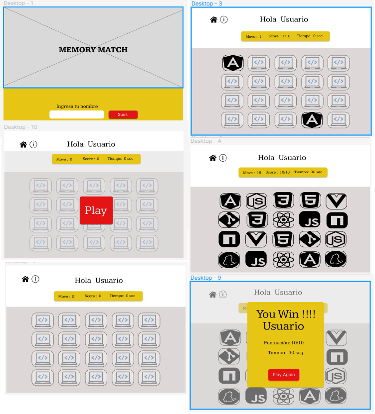

# Memory Match Game

## Índice

* [1. Definición del producto](#1-Definición-del-producto)
* [2. Historias de usuario](#2-Historias-de-usuario)
* [3. Prototipo de baja fidelidad](#3-Prototipo-de-baja-fidelidad)
* [4. Prototipo de alta fidelidad](#4-Prototipo-de-alta-fidelidad)
* [5. Tests de usabilidad](#5-Test-de-usailidad)

***

## 1. Definición del producto

En este proyecto se requiere hacer un juego de memoria(memory match), el usuario ingresa su nombre y empieza a jugar, al voltear todas las cartas se le mostrará que ganó. Este juego es para todo aquel que desee distraerse en sus tiempos libres y/o ejercitar su memoria.

## 2. Historias de usuario

### Historia 1

COMO jugador de memory match
QUIERO ingresar a una página de juegos de memory match 
PARA distraerme un poco de la rutina.

#### CRITERIOS DE ACEPTACIÓN

1. Se muestra una pantalla de bienvenida al usuario.
2. Una opción para ingresar su nombre.
3. Un botón para empezar a jugar y llevar a la segunda vista.

#### DEFINICIÓN DE TERMINADO

El usuario debe ingresar su nombre.
Y el boton "Start" enviará el nombre en la siguiente vista.

### Historia 2

COMO jugador del memory match 
QUIERO quitar el modal play 
PARA empezar a jugar.

#### CRITERIOS DE ACEPTACIÓN

Se debe visualizar las cartas en la pantalla listas para jugar, pero bloqueadas por el modal en el cual hay un botón'jugar'

#### DEFINICIÓN DE TERMINADO

1. En el encabezado se debe mostrar el nombre del usuario.
2. Se debe visualizar las 20 cartas volteadas.
3. El botón "Play" debe permitir  comenzar el juego.

### Historia 3

COMO jugador de Memory Match
QUIERO poder jugar en todos los dispositivos posibles :móviles y desktops.
PARA jugar desde cualquier lugar.

#### CRITERIOS DE ACEPTACIÓN

Que las diferentes vistas se ajusten a los diferentes dispositivos.
Las imágenes se ajustan al nuevo formato sin perder la estética del diseño.

#### DEFINICIÓN DE TERMINADO

El usuario debe visualizar el juego a un tamaño acorde a los dispositivos.

### Historia 4

COMO jugador de memory match QUIERO destapar la carta PARA encontrar sus pares.

#### CRITERIOS DE ACEPTACIÓN

Al voltear la primera carta esta se debe quedar destapa para compararla con la segunda.
Si dos cartas volteadas no coinciden en la figura, ambas deben regresar a su posición inicial.
Si dos cartas volteadas tienen la misma figura, deben permanecer destapadas.

#### DEFINICIÓN DE TERMINADO

La primera carta volteada debe permanecer volteada hasta destapar la segunda carta.
Si ambas cartas son del mismo modelo dejarlas destapadas para indicar al usuario que son validas.
En caso contrario cuando dos cartas destapadas no son del mismo modelo volverlas a tapar.

### Historia 5

COMO jugador del Memory Match 
QUIERO terminar el juego
PARA saber si he ganado.

#### CRITERIOS DE ACEPTACIÓN

1. El usuario debe ver todas las cartas volteadas en la pantalla.
2. Sale una ventana avisando que el jugador termina el juego.
3. El botón 'play again' baraja las cartas para comienzar un nuevo juego.

#### DEFINICIÓN DE TERMINADO

Cuando se visualice todas las cartas destapadas significa que el juego ha terminado y el usuario ha ganado.
Se mostrará una ventana felicitando al usuario.

## 3. Prototipo de baja fideldad

[Prototipo1](img.readme/Prototipo1.jpeg)

### Prototipo de alta fideldad

## 5.tests de usabilidad

En los test de usabilidad se detectó:

1. Que el juego no empiece si no se ha ingresado el nombre
2. Debíamos poner color a las cartas.
3. Determinar qué botón iba a barajar las cartas.